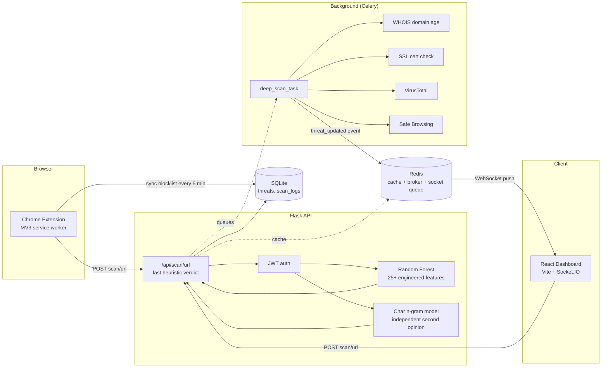

# Shadow Agent Pro

**Real-time, ML-powered malware & phishing detection.** Chrome extension + Flask API + React dashboard, with an async detection pipeline, an ensemble of two independently-trained models, live threat intelligence, and a system status page — built as a final-year B.Tech capstone, engineered like a real product.


Built by **Jay (Alladi Jaydurga)** and **Ranjith Kumar** — OM Sterling Global University.

---

## What it does

A URL comes in from either a live browser navigation (extension) or a manual check (dashboard). It gets a verdict in under a second from a two-model ensemble, then a background worker quietly cross-checks it against VirusTotal, Google Safe Browsing, live WHOIS, and SSL certificate data — and if the verdict changes, every connected client finds out over a WebSocket without asking. Confirmed-malicious domains get synced into the browser extension's native blocklist so repeat visits are blocked instantly, no round-trip required.

## Architecture



The fast path (top) never touches the network beyond the request itself — WHOIS, SSL handshakes, and external API calls all happen in the background task at the bottom, so a scan always returns in well under a second regardless of how slow those checks are.

## Feature overview

| Area | What's implemented |
|---|---|
| **Detection** | Random Forest (25+ lexical/domain/SSL features) + character n-gram model, ensembled; SHAP explainability with a hard timeout; typosquat detection (Levenshtein against curated brands) |
| **Real-time** | Async two-phase scanning (instant heuristic → background deep scan → WebSocket push); live activity feed; debounced live-as-you-type URL preview; proactive extension blocklist sync; toast notifications for live threats |
| **Dashboard** | Sidebar-navigated multi-page layout (Overview / Threats / Analytics / Live Ops / Settings); command palette (⌘K) for keyboard-driven navigation and instant URL scanning; notification center; threat detail drawer with full ensemble breakdown; searchable/filterable/exportable threat table; model performance, feature importance, and drift visualization; loading skeletons |
| **Analysis & docs** | Executable EDA notebook (`ml-training/notebooks/eda.ipynb` — class balance, feature distributions, feature importance, confusion matrix, verified to run end-to-end); a complete draft project report (`docs/report/`) with real results and a documented bug-fix case study, not placeholder text |
| **Real-time tracking** | Live requests/min, latency percentiles (p50/p95), and a live-updating scan-volume sparkline — pushed over WebSocket, not polled — backing a dedicated Live Ops tab |
| **Threat intel** | VirusTotal + Google Safe Browsing fusion (optional, degrades gracefully without API keys); geo-IP threat origin leaderboard |
| **Ops & reliability** | JWT auth on every route; Redis caching with in-memory fallback; rate limiting; structured logging with request IDs; `/api/status` system health endpoint; model version + drift monitoring |
| **Engineering** | 33 passing pytest tests; GitHub Actions CI (Python 3.11 + 3.12 matrix); Dockerized (backend, worker, Redis, dashboard); MIT licensed |

## Folder structure

```
shadow-agent-pro/
├── extension/              # Chrome MV3 — service worker, content script, popup
├── backend/                 # Flask API
│   ├── app.py                app factory, blueprint + logging setup
│   ├── auth.py                JWT issue/verify
│   ├── celery_app.py          async task broker config
│   ├── tasks.py                deep_scan_task (WHOIS/SSL/VT/SafeBrowsing)
│   ├── sockets.py              Flask-SocketIO event broadcasting
│   ├── logging_config.py       structured logs with request IDs
│   ├── models/database.py      SQLAlchemy models
│   ├── routes/                 scan, threats, stats, auth, geo, model, status
│   ├── ml/
│   │   ├── feature_extraction.py   25+ engineered features
│   │   ├── predict.py               RF + char-ngram ensemble, SHAP w/ timeout
│   │   ├── char_ngram_model.py      second-opinion classifier
│   │   └── artifacts/               trained models live here
│   ├── utils/                  whois, ssl, content scanner, typosquat, threat intel, geoip, cache, allowlist
│   └── tests/                  33 pytest tests, no network dependency
├── dashboard/               # React + Vite
│   └── src/components/       ThreatTable, StatisticsPanel, URLScanner, HistoryChart,
│                              LiveActivityFeed, GeoThreatPanel, SystemStatusPanel
├── ml-training/
│   ├── train.py                RF + char-ngram training, RandomizedSearchCV
│   ├── generate_sample_dataset.py   synthetic data for pipeline testing
│   ├── download_real_dataset.py     real 420K-row public dataset downloader
│   └── notebooks/eda.ipynb          exploratory data analysis (class balance,
│                                     feature distributions, importance, confusion matrix)
├── .github/workflows/ci.yml  # test + lint + build on every push
├── docker-compose.yml
├── LICENSE (MIT)
└── CONTRIBUTING.md
```

## Quick Start

### One-command setup (recommended)
```bash
python scripts/bootstrap.py
```
Detects what's missing — Python deps, trained model artifacts, `.env` — and does exactly the minimum needed to get to a runnable state. Safe to re-run any time; it skips anything already in place. Use `--check` to see status without changing anything, or `--sample-size N` to control how much real data to train on (default 3000/class).

**This exists specifically because model artifacts aren't shipped in the project zip** (they're large binaries) — every fresh extraction needs retraining before scans work, and forgetting that step produces a confusing "verdict: error" with no obvious cause. This script makes it impossible to forget.

### Manual path (if you want to see each step)
```bash
cd backend && pip install -r requirements.txt
cd ../ml-training && python generate_sample_dataset.py --n 3000
python train.py --data datasets/urls_labeled.csv --out ../backend/ml/artifacts --skip-whois
cd ../backend && python app.py
```

### Training on a real dataset
```bash
cd ml-training
python download_real_dataset.py --out datasets/urls_labeled_real.csv --max-per-class 3000
python train.py --data datasets/urls_labeled_real.csv --out ../backend/ml/artifacts --skip-whois
```
`download_real_dataset.py` pulls a real, public 420K-row labeled URL dataset (~345K benign / ~76K malicious) and converts it to the schema `train.py` expects. Expect meaningfully less-than-perfect accuracy on real data (~80-90%) versus the synthetic set (~100%) — that's the honest, correct result, not a regression. `train.py` now also trains the character n-gram second-opinion model automatically in the same run.

### Training on live threat intelligence (URLhaus + Tranco)
```bash
cd ml-training
python download_live_dataset.py --out datasets/urls_labeled_live.csv --max-per-class 3000
python train.py --data datasets/urls_labeled_live.csv --out ../backend/ml/artifacts
```
A stronger methodology than the static 2016 dataset above: combines **URLhaus** (currently-active malicious URLs, updated every 5 minutes, no registration required) with **Tranco** (a research-grade top-domains ranking, purpose-built as the academic replacement for the discontinued Alexa Top 1M — used by URLhaus itself, cited in 600+ academic papers). Since both sources track *live, current* URLs, dropping `--skip-whois` here is worth doing — the domain-age feature actually means something for current domains, unlike the mostly-defunct 2016 dataset.

**Honest caveat**: this script's CSV/zip parsing logic was verified against the real, documented formats of both sources, but the live HTTP downloads themselves couldn't be network-tested in the environment that built it. If either download fails, it's almost certainly a small format change on their end (these are actively-maintained external services) rather than a logic bug — report back what error you see and it can be fixed quickly.

### API keys (optional — everything runs fully without them)
```bash
cd backend && cp .env.example .env
```
Fill in `VIRUSTOTAL_API_KEY` / `SAFE_BROWSING_API_KEY` (both free-tier, links in `.env.example`). Hit `/api/status` after starting the server to confirm what's active — don't guess from logs alone.

### Option A — Docker
```bash
docker-compose up --build
```
### Option B — Manual
```bash
redis-server
cd backend && python app.py
cd backend && celery -A celery_app.celery_app worker --loglevel=info
cd dashboard && npm run dev
```

### Running tests
```bash
cd backend
pip install -r requirements-dev.txt
pytest tests/ -v
```

### Load the extension
`chrome://extensions` → Developer Mode → **Load unpacked** → select `extension/`. Icons are included — no setup needed there. The popup shows the live verdict, confidence bar, and the two-model ensemble breakdown (Random Forest vs. character n-gram) for whatever page you're currently on.

## API Endpoints

| Method | Endpoint | Description | Auth |
|---|---|---|---|
| POST | `/api/auth/token` | Issue a JWT | — |
| POST | `/api/scan/url` | Fast ensemble verdict, queues deep scan | JWT |
| POST | `/api/scan/content` | DOM indicators from extension | JWT |
| GET | `/api/threats` | Recent threats | JWT |
| GET | `/api/threats/<id>` | Single threat (deep-scan polling) | JWT |
| GET | `/api/threats/domains` | Malicious domains (blocklist sync) | JWT |
| DELETE | `/api/threats/<id>` | Remove a record | JWT |
| GET | `/api/stats` | Aggregate statistics | JWT |
| GET | `/api/geo/threats` | Geolocated threats + country rollup | JWT |
| GET | `/api/model/version` | Model metadata | JWT |
| GET | `/api/model/drift` | Drift vs. training baseline | JWT |
| GET | `/api/model/feature-importance` | Random Forest feature importances, ranked | JWT |
| GET | `/api/status` | Full system health check | JWT |
| GET | `/api/metrics` | Live operational metrics (requests/min, latency percentiles) | JWT |
| POST | `/api/feedback` | Log false positive/negative | — |
| GET | `/api/health` | Liveness check | — |

## Troubleshooting

Accumulated from real debugging sessions getting this running on Windows/Python 3.14 — read this before opening an issue.

- **Always `pip install -r requirements.txt`**, never install packages one at a time as errors appear — that's how you end up with the wrong package (`pip install jwt` installs an unrelated legacy package; you need **PyJWT**).
- **Very new Python versions (3.13+) often lack prebuilt wheels** for scikit-learn/shap for months after release, causing a `meson`/`cython` source-build failure. If `pip install` fails on scikit-learn's metadata generation, either use Python 3.11/3.12 in a fresh venv, or note that `requirements.txt` uses floor-pins (`>=`) specifically so pip can grab whatever wheel-having version is available.
- **A scan that takes 30-45+ seconds** almost always means Celery is retrying a connection to an unreachable Redis broker. This is now guarded against (`routes/scan.py` pre-checks Redis reachability with a 1s-timeout ping before ever calling `.delay()`) — if you still see this, confirm you're on the latest code.
- **`No trained model found`** on startup just means `ml/artifacts/` is empty — run the training step above.
- **CSV encoding errors** (`UnicodeDecodeError`) when reading a downloaded dataset on Windows — already fixed (`download_real_dataset.py` and `train.py` both force `encoding="utf-8"` explicitly rather than relying on the platform default).

## Known limitations (worth stating in your report/viva)

- **If you're upgrading from an earlier version of this project, delete `backend/instance/shadowagent.db` before restarting.** The `Threat` model gained a `char_ngram_score` column in this pass; SQLAlchemy's `db.create_all()` only creates missing tables, it doesn't alter existing ones, so an old database file will be missing that column and can cause errors on insert. Deleting it just means a fresh, empty threat history — nothing else is lost.
- SQLite under concurrent writes from Flask + Celery can hit "database is locked" under heavy load — fine for a demo, a real deployment would use Postgres.
- VirusTotal/Safe Browsing silently no-op without API keys — by design, not a bug, but be ready to explain it live.
- The extension's deep-scan follow-up uses short-lived polling, not a socket — a full Socket.IO client is heavy for a service worker; this is a deliberate tradeoff.
- The character n-gram model is TF-IDF + Logistic Regression, not a CNN/LSTM — a deliberate choice to avoid adding TensorFlow/PyTorch as a hard dependency given the wheel-availability pain already hit with scikit-learn; it captures much of the same subword-pattern signal without the fragility.
- `download_real_dataset.py`'s source data is ~2016-era and binary-labeled (malicious encompasses phishing + malware + spam, not phishing-specifically) — mention this if your report claims phishing-specific accuracy.
- **The character n-gram model can learn a real but unhelpful pattern from phishing data: popular brands are heavily over-represented in the malicious class, because attackers impersonate them constantly.** This was caught during manual testing — `https://www.google.com` scored 93% malicious on the char n-gram model alone, because in the training sample, brand-impersonation domains containing "goog" outnumbered legitimate Google URLs. Fixed with a small, curated allowlist (`utils/allowlist.py`) checked by exact registered-domain match (not substring, so it can't be defeated by a phishing domain merely containing a brand name — verified with regression tests in `tests/test_allowlist.py`). This is a genuinely good thing to discuss in a report or viva: it's a real example of why ensembling and sanity-checking against real-world data matters, not something to hide.
